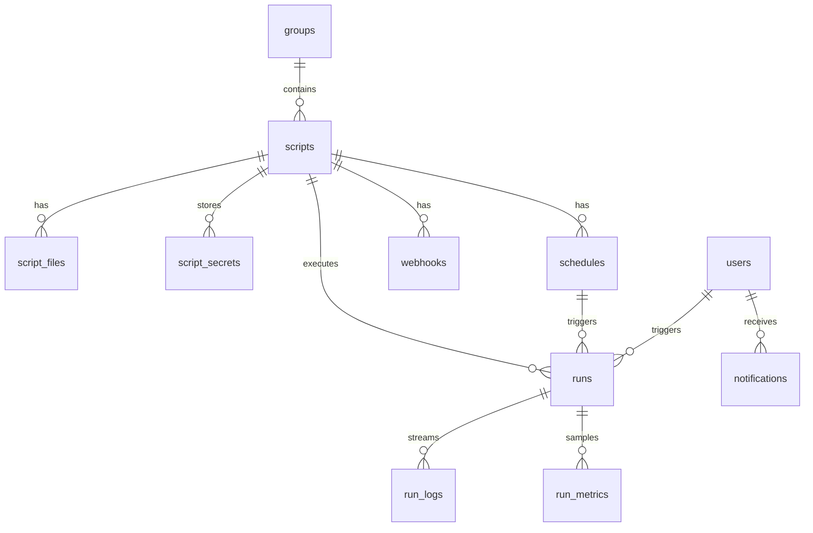

PostgreSQL 16. Primary keys UUID. `created_at` / `updated_at` timestamps on entities.

> **Note:** The full ER diagram in the repository describes the target model. In v0.1, RBAC is implemented through enum roles on `users.role`, without normalized tables `roles` / `permissions`.

## Basic tables (v0.1)

| Table | Destination |
|---------|------------|
| `users` | Accounts, enum roles |
| `groups` | Script Groups |
| `scripts` | Script/bot metadata |
| `script_files` | Sources (content in the database + sync with MinIO) |
| `script_secrets` | Encrypted Secrets |
| `script_templates` | Templates |
| `schedules` | Cron / interval / webhook |
| `webhooks` | Incoming hooks |
| `runs` | Execution history |
| `run_logs` | Log lines |
| `run_metrics` | CPU/RAM samples |
| `notifications` | In-app alerts |
| `notification_dismissals` | Hidden Alerts |
| `backups` | Backup metadata |
| `backup_settings` | Schedule Settings |
| `audit_logs` | Audit Log |

## ER (simplified)

## Run statuses

`queued` → `running` → `success` | `failed` | `timeout` | `cancelled`

## Migrations

v0.1: `create_all()` at startup + `schema_patches.py` for hotfix FK.

Alembic - in [roadmap]({{ '/en/roadmap/' | relative_url }}).

## Full specification

Source with detailed fields: [database-er.md](https://github.com/PyOrchestrator/PyOrchestrator/blob/main/docs/database-er.md) in the repository.
