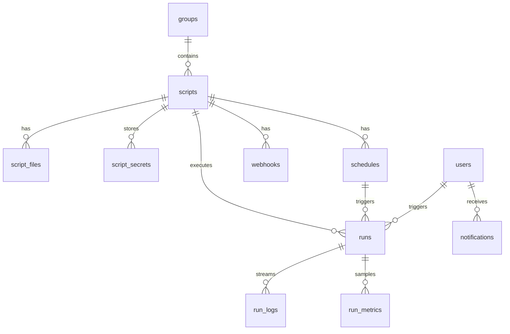

PostgreSQL 16. UUID primary keys. Timestamps `created_at` / `updated_at` на сущностях.

> **Примечание:** полная ER-диаграмма в репозитории описывает целевую модель. В v0.1 RBAC реализован через enum-роли на `users.role`, без нормализованных таблиц `roles` / `permissions`.

## Основные таблицы (v0.1)

| Таблица | Назначение |
|---------|------------|
| `users` | Аккаунты, role enum |
| `groups` | Группы скриптов |
| `scripts` | Метаданные скриптов/ботов |
| `script_files` | Исходники (content в DB + MinIO sync) |
| `script_secrets` | Encrypted secrets |
| `script_templates` | Шаблоны |
| `schedules` | Cron / interval / webhook |
| `webhooks` | Inbound hooks |
| `runs` | История выполнений |
| `run_logs` | Строки логов |
| `run_metrics` | CPU/RAM samples |
| `notifications` | In-app alerts |
| `notification_dismissals` | Dismissed alerts |
| `backups` | Backup metadata |
| `backup_settings` | Schedule config |
| `audit_logs` | Audit trail |

## ER (упрощённо)

## Run statuses

`queued` → `running` → `success` | `failed` | `timeout` | `cancelled`

## Миграции

v0.1: `create_all()` при старте + `schema_patches.py` для hotfix FK.

Alembic в roadmap — см. [Roadmap](/roadmap/).

## Полная спецификация

Исходник с детальными полями: [database-er.md](https://github.com/Developer-RU/pyorchestrator/blob/main/docs/database-er.md) в репозитории.
